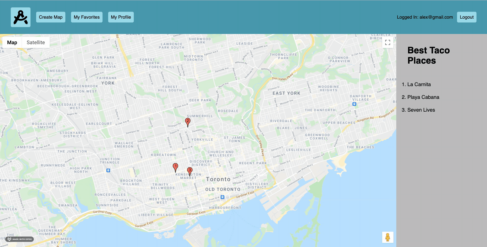

# Summary

Multipage application that allows users to collaboratively create, edit and share maps which list multiple points of interest

# Functionality

## Home Page

Displays all available maps to the user. If a user is logged in they are able to favourite maps they find interesting.

## Viewing Map

When viewing a map, a list of all points of interest will be presented to the left of the map. Clicking on a point on the map will bring up the details of the location.

## Creating Map

When creating a map click on the location you wish to add a marker and fill out the dropdown form that appears.

# Project Structure

- Front-End
  - [Views](/views)
  - [Styles](/styles)
  - [Scripts](/public/scripts)
- Back-End
  - [Server](./server.js)
  - [Routes](/routes)
  - [Schema](/db/schema)
  - [Seeds](/db/seeds)

## Project Setup

1. [Fork](https://github.com/araff-16/Wiki-Maps/fork) this repository and clone to your local device.
2. Install dependencies with `npm install` 
3. Create the `.env` by using `.env.example` as a reference: `cp .env.example .env`
4. Fix to binaries for sass: `npm rebuild node-sass`
5. Reset database: `npm run db:reset`
7. Run the server: `npm run local`
  - Note: nodemon is used, so you should not have to restart your server
8. Visit `http://localhost:8080/`

